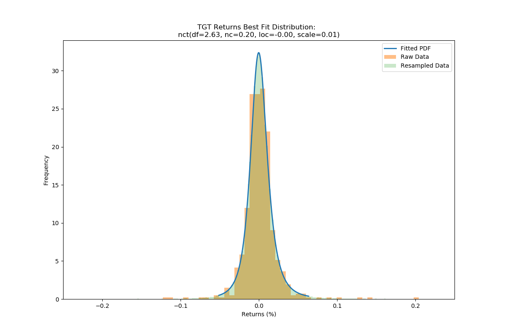
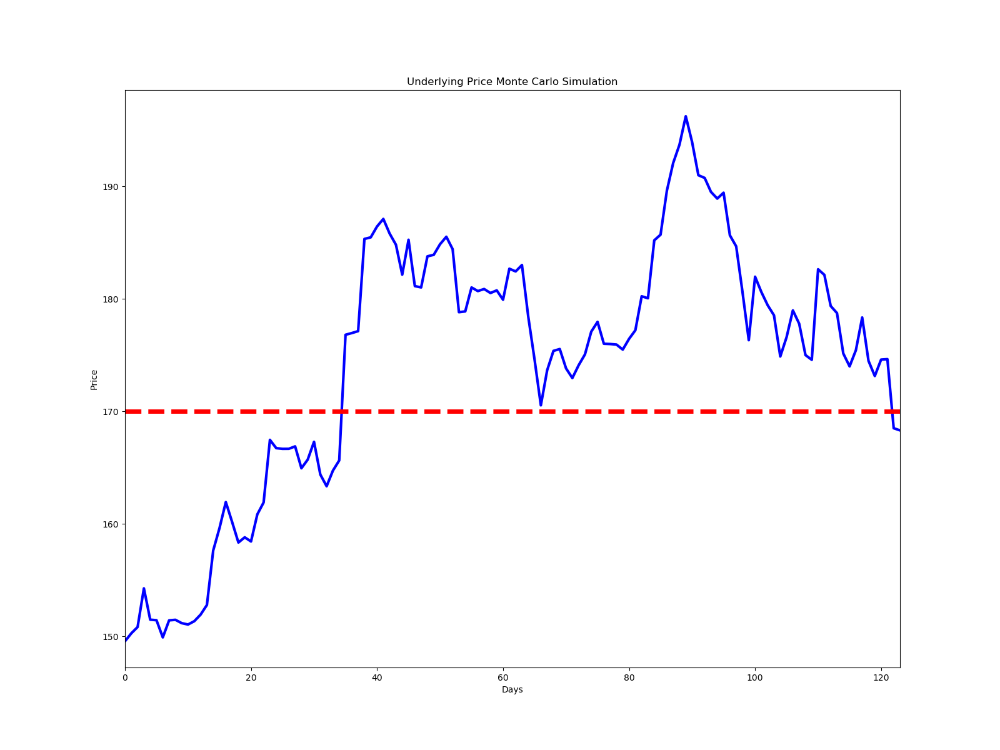

Dynamic Delta Hedging Options Simulator
---------------------

 * Introduction
 * Setup
 * Running the Application
 * Example
  * Results
  * Statistics

Introduction
------------

This application allows the user to input an option and current implied vol to simulate buying/selling the option and
dynamically hedging with the underlying using price movements drawn from a fitted distribution of historical 
price changes. The daily PnL is calculated to determine if the venture is likely to be profitable based on the 
difference in the implied vol at the time of option sale/purchase and realized vol at expiration, or implied vol
at time of closing the position.

Setup
------------

To properly run the application, you will need python installed on your machine. You will need 
to create a python 3.7 environment using the req.txt file in the command line.

`pip install -r req.txt
`

Running the Application
-------------
To run the application, open the project in your favorite IDE and activate your python environment
from above. Run the main.py file. 

If you prefer the command line, enter the directory of the project and activate your python environment
created above and run:

`
python main.py
` 

Output png files will be saved and the simulation statistics will be printed in the terminal.


Example
-----------------

With the current settings, the simulation buys a TGT call option and hedges
it using the TGT underlying stock. For index options like the SPX, the number 
of underlying shares would be adjusted by a factor of 5 if hedged with /MES futures. 
The key is to remain delta neutral throughout the investment horizon.

We set the initial params of our call option based on mkt prices:

```       
implied_vol = 0.30
time_to_expiration = 123 / 365
strike = 170
```

We fit the historical price changes of TGT to all scipy distributions to find it fits to a non-central t.

```
BEST Distribution: nct
Params: (2.630510024517632, 0.20419027844831944, -0.0019616244145557226, 0.011198148337431085)
SSE: 755.5589531518674


```

 

Results:
-----------------
We simulate price changes of the underlying TGT stock from this distribution
to analyze a daily delta hedge at market close. 



Final PnL:
```
PNL on Expiration: -202.73655604290468
Realized Vol: 0.23980855475845242
```
Details:
```
     underlying_price   pct_chg    deltas  pf_shares  shares_purchased    trxn_costs  option_price  cum_trxn_costs  earlyexit_share_pnl  earlyexit_option_pnl  earlyexit_pnl
0          149.580000  0.004705  0.290825      -29.0             -29.0  -4337.820000      4.355023    -4337.820000                  NaN              0.000000            NaN
1          150.283779  0.003721  0.298865      -30.0              -1.0   -150.283779      4.520387    -4488.103779           -20.409588             16.536363      -3.873225
2          150.843016  0.022791  0.305080      -31.0              -1.0   -150.843016      4.646259    -4638.946795           -37.186713             29.123604      -8.063109
3          154.280867 -0.018035  0.351056      -35.0              -4.0   -617.123466      5.728014    -5256.070261          -143.760066            137.299105      -6.460961
4          151.498366 -0.000329  0.311415      -31.0               4.0    605.993465      4.760526    -4650.076796           -46.372560             40.550269      -5.822291
5          151.448483 -0.010070  0.309461      -31.0               0.0      0.000000      4.700680    -4650.076796           -44.826176             34.565692     -10.260484
6          149.923472  0.010091  0.287529      -29.0               2.0    299.846945      4.202108    -4350.229851             2.449149            -15.291495     -12.842346
7          151.436341  0.000330  0.306709      -31.0              -2.0   -302.872682      4.608079    -4653.102533           -41.424045             25.305543     -16.118502
8          151.486385 -0.001955  0.306086      -31.0               0.0      0.000000      4.578847    -4653.102533           -42.975398             22.382336     -20.593062
9          151.190257 -0.000822  0.300690      -30.0               1.0    151.190257      4.444529    -4501.912276           -33.795442              8.950592     -24.844850
10         151.065924  0.001976  0.297636      -30.0               0.0      0.000000      4.363068    -4501.912276           -30.065458              0.804418     -29.261040
11         151.364384  0.003864  0.300394      -30.0               0.0      0.000000      4.407857    -4501.912276           -39.019256              5.283359     -33.735897
12         151.949234  0.005606  0.307172      -31.0              -1.0   -151.949234      4.540394    -4653.861510           -56.564734             18.537032     -38.027702
13         152.801054  0.031716  0.317820      -32.0              -1.0   -152.801054      4.760396    -4806.662564           -82.971164             40.537266     -42.433898
14         157.647269  0.012636  0.387016      -39.0              -7.0  -1103.530885      6.417029    -5910.193449          -238.050054            206.200556     -31.849498
15         159.639244  0.014477  0.415632      -42.0              -3.0   -478.917733      7.162366    -6389.111182          -315.737086            280.734271     -35.002815
16         161.950415 -0.010935  0.449396      -45.0              -3.0   -485.851246      8.105573    -6874.962428          -412.806259            375.054924     -37.751335
17         160.179525 -0.011401  0.421756      -42.0               3.0    480.538576      7.277384    -6394.423852          -333.116209            292.236068     -40.880141
18         158.353248  0.002931  0.393109      -39.0               3.0    475.059744      6.478092    -5919.364108          -256.412564            212.306861     -44.105704
19         158.817391 -0.002331  0.399024      -40.0              -1.0   -158.817391      6.607281    -6078.181499          -274.514136            225.225736     -49.288401
20         158.447127  0.015203  0.392276      -39.0               1.0    158.447127      6.405919    -5919.734372          -259.703589            205.089536     -54.614053
21         160.855977  0.006579  0.428094      -43.0              -4.0   -643.423907      7.337733    -6563.158279          -353.648719            298.270998     -55.377721
22         161.914272  0.034364  0.443453      -44.0              -1.0   -161.914272      7.740777    -6725.072551          -399.155430            338.575331     -60.580099
23         167.478321 -0.004397  0.528134      -53.0              -9.0  -1507.304892     10.383341    -8232.377443          -643.973588            602.831781     -41.141807
24         166.741909 -0.000371  0.516378      -52.0               1.0    166.741909      9.935780    -8065.635534          -604.943739            558.075610     -46.868129
25         166.680031  0.000024  0.514842      -51.0               1.0    166.680031      9.840880    -7898.955503          -601.726088            548.585687     -53.140401
26         166.684047  0.001285  0.514309      -51.0               0.0      0.000000      9.779702    -7898.955503          -601.930869            542.467876     -59.462992
27         166.898304 -0.011648  0.517037      -52.0              -1.0   -166.898304      9.826609    -8065.853807          -612.858022            547.158515     -65.699507
28         164.954205  0.004677  0.485916      -49.0               3.0    494.862614      8.788282    -7570.991194          -511.764828            443.325831     -68.438997
29         165.725672  0.009529  0.497383      -50.0              -1.0   -165.725672      9.104398    -7736.716866          -549.566746            474.937412     -74.629334
30         167.304832 -0.017378  0.521657      -52.0              -2.0   -334.609665      9.844771    -8071.326531          -628.524754            548.974782     -79.549972
31         164.397345 -0.006329  0.474677      -47.0               5.0    821.986727      8.331984    -7249.339804          -477.335433            397.696094     -79.639338
32         163.356817  0.008504  0.457001      -46.0               1.0    163.356817      7.784431    -7085.982986          -428.430601            342.940715     -85.489886
33         164.745926  0.005491  0.478668      -48.0              -2.0   -329.491852      8.371047    -7415.474839          -492.329617            401.602361     -90.727256
34         165.650566  0.067409  0.492585      -49.0              -1.0   -165.650566      8.745883    -7581.125405          -535.752320            439.085915     -96.666405
35         176.816942  0.000862  0.663631      -66.0             -17.0  -3005.888020     15.156561   -10587.013424         -1082.904771           1080.153773      -2.750997
36         176.969291  0.000961  0.666009      -67.0              -1.0   -176.969291     15.189711   -10763.982716         -1092.959805           1083.468793      -9.491012
37         177.139372  0.046271  0.668659      -67.0               0.0      0.000000     15.234807   -10763.982716         -1104.355197           1087.978341     -16.376856
38         185.335763  0.000750  0.773196      -77.0             -10.0  -1853.357629     21.092617   -12617.340345         -1653.513399           1673.759379      20.245980
39         185.474841  0.005211  0.775554      -78.0              -1.0   -185.474841     21.135972   -12802.815186         -1664.222438           1678.094905      13.872468
40         186.441280  0.003597  0.787077      -79.0              -1.0   -186.441280     21.826987   -12989.256466         -1739.604673           1747.196311       7.591638
41         187.111835 -0.006945  0.795195      -80.0              -1.0   -187.111835     22.293894   -13176.368301         -1792.578495           1793.887008       1.308513
42         185.812390 -0.005351  0.781863      -78.0               2.0    371.624780     21.205083   -12804.743521         -1688.622902           1685.005974      -3.616928
43         184.818063 -0.014375  0.771349      -77.0               1.0    184.818063     20.367545   -12619.925458         -1611.065420           1601.252197      -9.813223
44         182.161326  0.017011  0.739686      -74.0               3.0    546.483978     18.292620   -12073.441480         -1406.496634           1393.759699     -12.736935
45         185.260025 -0.022225  0.778231      -78.0              -4.0   -741.040099     20.578206   -12814.481580         -1635.800356           1622.318211     -13.482145
46         181.142543 -0.000649  0.727805      -73.0               5.0    905.712715     17.407383   -11908.768865         -1314.636771           1305.235966      -9.400805
47         181.025061  0.015268  0.726919      -73.0               0.0      0.000000     17.252254   -11908.768865         -1306.060599           1289.723023     -16.337576
48         183.788948  0.000724  0.763326      -76.0              -3.0   -551.366844     19.243348   -12460.135709         -1507.824351           1488.832428     -18.991923
49         183.921959  0.005121  0.765866      -77.0              -1.0   -183.921959     19.276986   -12644.057668         -1517.933150           1492.196235     -25.736915
50         184.863863  0.003594  0.778276      -78.0              -1.0   -184.863863     19.936397   -12828.921532         -1590.459821           1558.137395     -32.322425
51         185.528224 -0.005949  0.787175      -79.0              -1.0   -185.528224     20.389121   -13014.449755         -1642.279905           1603.409776     -38.870129
52         184.424479 -0.030369  0.774931      -77.0               2.0    368.848958     19.459211   -12645.600797         -1555.084089           1510.418794     -44.665295
53         178.823608  0.000383  0.699803      -70.0               7.0   1251.765259     15.251439   -11393.835538         -1123.817052           1089.641523     -34.175529
54         178.892173  0.011910  0.701445      -70.0               0.0      0.000000     15.225885   -11393.835538         -1128.616570           1087.086192     -41.530378
55         181.022801 -0.001778  0.732983      -73.0              -3.0   -543.068404     16.681080   -11936.903942         -1277.760561           1232.605612     -45.154949
56         180.700997  0.001009  0.729272      -73.0               0.0      0.000000     16.372919   -11936.903942         -1254.268852           1201.789579     -52.479273
57         180.883370 -0.001967  0.732730      -73.0               0.0      0.000000     16.432929   -11936.903942         -1267.582087           1207.790585     -59.791502
58         180.527587  0.001304  0.728486      -73.0               0.0      0.000000     16.099233   -11936.903942         -1241.609919           1174.420953     -67.188966
59         180.762977 -0.004601  0.732791      -73.0               0.0      0.000000     16.197026   -11936.903942         -1258.793384           1184.200254     -74.593130
60         179.931214  0.015324  0.721430      -72.0               1.0    179.931214     15.517360   -11756.972728         -1198.074702           1116.233612     -81.841090
61         182.688420 -0.001321  0.761984      -76.0              -4.0   -730.753681     17.488845   -12487.726409         -1396.593530           1313.382169     -83.211361
62         182.447065  0.003121  0.759787      -76.0               0.0      0.000000     17.231842   -12487.726409         -1378.250539           1287.681889     -90.568649
63         183.016402 -0.025061  0.768815      -77.0              -1.0   -183.016402     17.593471   -12670.742811         -1421.520152           1323.844727     -97.675425
64         178.429748 -0.021358  0.701446      -70.0               7.0   1249.008233     14.141176   -11421.734578         -1068.347749            978.615290     -89.732459
65         174.618837 -0.023317  0.636978      -64.0               6.0   1047.713020     11.508485   -10374.021558          -801.583988            715.346138     -86.237850
66         170.547202  0.018261  0.560504      -56.0               8.0   1364.377617      8.986556    -9009.643942          -540.999376            463.153245     -77.846131
67         173.661650  0.009923  0.619965      -62.0              -6.0  -1041.969899     10.742987   -10051.613841          -715.408449            638.796397     -76.612051
68         175.384974  0.000936  0.651995      -65.0              -3.0   -526.154923     11.756372   -10577.768763          -822.254564            740.134864     -82.119700
69         175.549154 -0.009794  0.655483      -66.0              -1.0   -175.549154     11.780751   -10753.317918          -832.926278            742.572771     -90.353506
70         173.829854 -0.004935  0.623828      -62.0               4.0    695.319417     10.596802   -10057.998501          -719.452456            624.177845     -95.274611
71         172.971983  0.006593  0.607412      -61.0               1.0    172.971983      9.983640    -9885.026518          -666.264442            562.861646    -103.402796
72         174.112389  0.005512  0.629874      -63.0              -2.0   -348.224778     10.603497   -10233.251296          -735.829209            624.847347    -110.981862
73         175.072122  0.011557  0.648762      -65.0              -2.0   -350.144244     11.131069   -10583.395540          -796.292389            677.604573    -118.687817
74         177.095490  0.004910  0.687237      -69.0              -4.0   -708.381960     12.397124   -11291.777500          -927.811312            804.210092    -123.601220
75         177.965035 -0.010931  0.703924      -70.0              -1.0   -177.965035     12.916750   -11469.742535          -987.809900            856.172626    -131.637275
76         176.019653 -0.000143  0.668897      -67.0               3.0    528.058958     11.494551   -10941.683577          -851.633156            713.952783    -137.680372
77         175.994523 -0.000275  0.669237      -67.0               0.0      0.000000     11.389700   -10941.683577          -849.949463            703.467641    -146.481822
78         175.946140 -0.002534  0.669149      -67.0               0.0      0.000000     11.268493   -10941.683577          -846.707825            691.346975    -155.360851
79         175.500340  0.005432  0.661169      -66.0               1.0    175.500340     10.882129   -10766.183237          -816.839185            652.710530    -164.128655
80         176.453591  0.004340  0.681015      -68.0              -2.0   -352.907182     11.431453   -11119.090419          -879.753761            707.642997    -172.110764
81         177.219315  0.017038  0.697108      -70.0              -2.0   -354.438630     11.868763   -11473.529049          -931.822986            751.373941    -180.449045
82         180.238756 -0.000975  0.754209      -75.0              -5.0   -901.193781     13.972765   -12374.722830         -1143.183885            961.774205    -181.409680
83         180.063026  0.028579  0.752979      -75.0               0.0      0.000000     13.753552   -12374.722830         -1130.004106            939.852852    -190.151254
84         185.209049  0.002733  0.835790      -84.0              -9.0  -1666.881439     17.768043   -14041.604269         -1515.955832           1341.301933    -174.653900
85         185.715147  0.021045  0.845085      -85.0              -1.0   -185.715147     18.117506   -14227.319416         -1558.468110           1376.248223    -182.219887
86         189.623445  0.012953  0.893347      -89.0              -4.0   -758.493779     21.448230   -14985.813195         -1890.673378           1709.320674    -181.352704
87         192.079626  0.008467  0.918572      -92.0              -3.0   -576.238877     23.612329   -15562.052072         -2109.273496           1925.730600    -183.542896
88         193.705870  0.013068  0.933616      -93.0              -1.0   -193.705870     25.062019   -15755.757942         -2258.887951           2070.699583    -188.188368
89         196.237205 -0.011632  0.951961      -95.0              -2.0   -392.474410     27.398132   -16148.232352         -2494.302142           2304.310900    -189.991243
90         193.954607 -0.015245  0.940219      -94.0               1.0    193.954607     25.187547   -15954.277745         -2277.455350           2083.252312    -194.203038
91         190.997769 -0.001264  0.919971      -92.0               2.0    381.995539     22.379438   -15572.282206         -1999.512579           1802.441439    -197.071141
92         190.756371 -0.006518  0.920717      -92.0               0.0      0.000000     22.096681   -15572.282206         -1977.303939           1774.165745    -203.138195
93         189.513108 -0.003135  0.912158      -91.0               1.0    189.513108     20.894786   -15382.769099         -1862.923693           1653.976230    -208.947463
94         188.918925  0.002767  0.909405      -91.0               0.0      0.000000     20.288694   -15382.769099         -1808.853100           1593.367071    -215.486029
95         189.441708 -0.019974  0.917871      -92.0              -1.0   -189.441708     20.701675   -15572.210807         -1856.426330           1634.665119    -221.761210
96         185.657869 -0.005292  0.878184      -88.0               4.0    742.631478     17.229410   -14829.579329         -1508.313180           1287.438647    -220.874533
97         184.675401 -0.021932  0.868355      -87.0               1.0    184.675401     16.292849   -14644.903927         -1421.855994           1193.782561    -228.073433
98         180.625036 -0.023749  0.803733      -80.0               7.0   1264.375251     12.811080   -13380.528677         -1069.474192            845.605680    -223.868512
99         176.335441  0.031996  0.711182      -71.0               9.0   1587.018965      9.447990   -11793.509712          -726.306565            509.296693    -217.009872
100        181.977549 -0.007506  0.837339      -84.0             -13.0  -2365.708132     13.731825   -14159.217844         -1126.896240            937.680198    -189.216042
101        180.611632 -0.006468  0.815902      -82.0               2.0    361.223265     12.506861   -13797.994579         -1012.159279            815.183765    -196.975515
102        179.443444 -0.004993  0.795950      -80.0               2.0    358.886887     11.463186   -13439.107692          -916.367797            710.816265    -205.551532
103        178.547561 -0.020499  0.780148      -78.0               2.0    357.095123     10.649356   -13082.012569          -844.697224            629.433279    -215.263945
104        174.887576  0.009828  0.686646      -69.0               9.0   1573.988181      7.838923   -11508.024388          -559.218335            348.389946    -210.828389
105        176.606295  0.013451  0.739752      -74.0              -5.0   -883.031475      8.939911   -12391.055863          -677.809967            458.488781    -219.321187
106        178.981742 -0.006607  0.806084      -81.0              -7.0  -1252.872191     10.659802   -13643.928053          -853.593008            630.477823    -223.115186
107        177.799166 -0.015678  0.782436      -78.0               3.0    533.397499      9.604101   -13110.530555          -757.804407            524.907804    -232.896603
108        175.011572 -0.002398  0.706064      -71.0               7.0   1225.081005      7.395829   -11885.449549          -540.372075            304.080528    -236.291547
109        174.591914  0.046087  0.696951      -70.0               1.0    174.591914      6.960561   -11710.857635          -510.576363            260.553801    -250.022562
110        182.638250 -0.002734  0.907634      -91.0             -21.0  -3835.403245     13.396304   -15546.260880         -1073.819848            904.128010    -169.691838
111        182.138847 -0.015170  0.907474      -91.0               0.0      0.000000     12.855085   -15546.260880         -1028.374232            850.006115    -178.368117
112        179.375888 -0.003518  0.861215      -86.0               5.0    896.879442     10.306548   -14649.381438          -776.944973            595.152413    -181.792559
113        178.744842 -0.020084  0.856013      -86.0               0.0      0.000000      9.647778   -14649.381438          -722.674951            529.275458    -193.399492
114        175.154857 -0.006543  0.752962      -75.0              11.0   1926.703427      6.604943   -12722.678010          -413.936268            224.991978    -188.944290
115        174.008876  0.008261  0.716227      -72.0               3.0    522.026628      5.591762   -12200.651382          -327.987692            123.673883    -204.313809
116        175.446360  0.016557  0.788983      -79.0              -7.0  -1228.124519      6.498743   -13428.775901          -431.486529            214.371956    -217.114573
117        178.351222 -0.021577  0.901022      -90.0             -11.0  -1961.863439      8.816868   -15390.639340          -660.970616            446.184435    -214.786182
118        174.502934 -0.007734  0.782781      -78.0              12.0   2094.035206      5.393153   -13296.604134          -314.624707            103.812935    -210.811773
119        173.153318  0.008415  0.731833      -73.0               5.0    865.766589      4.151048   -12430.837546          -209.354647            -20.397512    -229.752159
120        174.610458  0.000223  0.844368      -84.0             -11.0  -1920.715041      5.071375   -14351.552587          -315.725909             71.635163    -244.090746
121        174.649375 -0.035141  0.892227      -89.0              -5.0   -873.246877      4.898811   -15224.799464          -318.994952             54.378789    -264.616163
122        168.512025 -0.001133  0.293467      -29.0              60.0  10110.721515      0.484934    -5114.077949           227.229217           -387.008979    -159.779762
123        168.321109       NaN  0.000000        0.0              29.0   4881.312161      0.000000     -232.765788           232.765788           -435.502344    -202.736556
```


